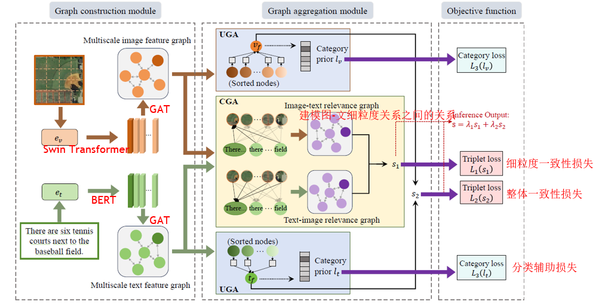
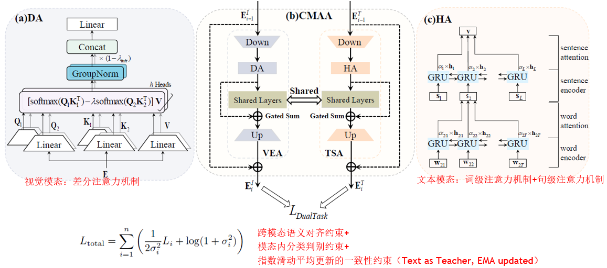
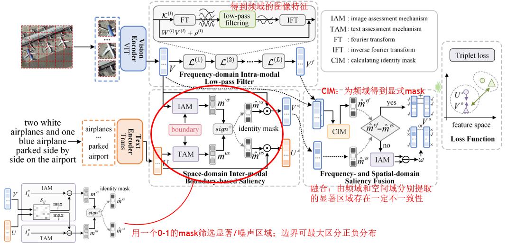

本文回顾总结了近期在遥感图像跨模态检索领域的一些最新文献资源。

# Graph-based hierarchical semantic consistency network for remote sensing image-text retrieval

> **Authors**: Meiting Wang, Jie Guo*, Senior Member, IEEE, Bin Song, Senior Member, IEEE, Kangxiang Su
>
> **Journal**: IEEE Journal of Selected Topics in Applied Earth Observations and Remote Sensing (Early Access)
>
> **Date of Publication:** 11 June 2025
>
> **Link**: https://ieeexplore.ieee.org/abstract/document/11031116
>
> **Keywords**: remote sensing image-text retrieval (RSITR), cross-modal similarity, graph neural networks, feature aggregation,
> hierarchical alignment
>
> **Type**: Swin Transformer/BERT+GNN

## The Problem

- **问题一：缺乏模态间语义交互，跨模态对齐不精准**

  - 现有方法通常将图像与文本分别提取特征，然后在共享空间进行对齐。

  - 这种“整体特征对齐”方式忽视了模态间细粒度的语义交互，难以有效区分语义相近但细节不同的数据。

  - 模型可能忽略图像中语义不一致的片段，导致检索错误。

- **问题二：局部特征聚合方式简单，导致信息损失**
  - 多数方法采用简单的门控机制（如 sigmoid + 乘法）对图像区域或文本词汇进行聚合，无法有效整合不显眼对象或抽象语义。
  - 在视觉上高度相似的图像之间，仅依赖显著目标（如“船”、“港口”）的语义很难区分；对象之间的空间关系、相对位置等结构化语义信息被忽视。

## Motivation

- **动机一：充分利用图神经网络（GNN）建模复杂语义关系**
  - GNN 能够有效建模图像区域或文本单元之间的局部关系和结构依赖。在自然图文检索中，GNN 已展示出在建模语义交互方面的潜力。
  - 遥感图像中的目标具有尺度多样、布局复杂等特点，非常适合使用 GNN 来捕捉细粒度结构化语义。
- **动机二：实现层次语义一致性，从整体到细节优化检索效果**
  - 相比传统方法仅对整体特征进行匹配，引入“层次语义一致性”概念，即同时对齐整体语义和局部语义（如重要对象）
- **动机三：构建更加精细的图结构融合策略**
  - 一方面在单模态内部自适应融合显著性特征；另一方面进行模态间交互，捕捉图像与文本间的细粒度语义对应关系，以此增强特征判别性、改善语义匹配效果，实现更精准的图文检索。

## The Approach

# Representation Discrepancy Bridging Method for Remote Sensing Image-Text Retrieval

> **Authors**: Hailong Ning, Siying Wang, Tao Lei, Xiaopeng Cao, Huanmin Dou, Bin Zhao, Asoke K. Nandi, Petia Radeva
>
> **Journal**: arXiv
>
> **Date of Publication:** 23 May 2025
>
> **Link**: https://arxiv.org/abs/2505.16756
>
> **Keywords**: Remote Sensing Image-Text Retrieval, Vision-and-Language Pre-training, Parameter-Efficient Fine-Tuning, Cross-Modal Asymmetric Adapter, Multi-Task Learning
>
> **Type**: GeoRSCLIP(ViT-B-32-RET-2) + Adapter PEFT

## The Problem

- **问题一：模态优化不对称：文本主导图像**
  - 文本模态语义判别性强、表达集中，在训练中容易主导优化；图像模态则冗余多、语义分散，特征提取难度更高。
  - 现有主流 PEFT（参数高效微调）方法普遍采用对称适配器结构（图像与文本使用相同结构），未考虑两者特性差异。
- **问题二：单任务训练约束弱，缺乏鲁棒对齐能力**
  - 多数现有 RSITR 模型采用单一的图文匹配任务进行训练，缺乏对模态内判别性、训练过程分布稳定性的辅助约束，对遥感图像中多目标、大尺度、跨域分布变化强的特点适应性差。

## Motivation

- **动机一：打破对称结构限制**
  - 引入非对称适配器结构（CMAA），让图像和文本分别使用更适配自身结构的调优策略。
  - 图像使用差分注意力（DA）提取细粒度视觉特征；文本使用层次注意力（HA）增强语义提取。
- **动机二：提升微调过程的泛化与稳定性**
  - 单一任务的微调方法约束不够；引入双任务一致性损失（DTCL），强化跨模态对齐，引入模态内分类监督；增加指数滑动一致性项，提升训练稳定性。

## The Approach

# Frequency- and Spatial-Domain Saliency Network for Remote Sensing Cross-Modal Retrieval

> **Authors**: Chengyu Zheng , Jie Nie , Member, IEEE, Bo Yin , Member, IEEE, Xiu Li , Yuntao Qian , Senior Member, IEEE, and Zhiqiang Wei , Member, IEEE
>
> **Journal**: IEEE Transactions on Geoscience and Remote Sensing (Volume: 63)
>
> **Date of Publication:** 16 April 2025
>
> **Link**: https://ieeexplore.ieee.org/abstract/document/10966929
>
> **Keywords**: Cross-modal retrieval, remote sensing (RS), spatial and frequency
>
> **Type**: RemoteCLIP+Fourier Transform

## The Problem

- 本文旨在解决遥感图文跨模态检索中的特征表示不鲁棒、噪声干扰大、模态对齐困难等关键问题，具体表现为空间域显著性建模方法的局限。
  - 现有方法主要基于空间域（如卷积、注意力机制）提取特征，但遥感图像因低分辨率、高噪声、目标分散，容易在训练过程中引入噪声转移、信息平滑、小目标丢失等问题。这种处理方式无法有效过滤遥感图像中由传感器距离、大气干扰等引起的噪声，降低了跨模态检索的准确性。

## Motivation

- 动机一：引入频域建模，利用低频去噪能力增强特征鲁棒性
  - 使用傅里叶变换 + 低通滤波，提取低频主干结构（如道路、建筑）；剔除高频中的纹理扰动与大气噪声，从而获取更稳定的图像表示；
  - 是首个在 RSITR 中系统引入频域显著性学习的研究。
- 动机二：抛弃传统跨模态注意力机制，引入边界引导的空间显著性挖掘
  - 基于图文相似度分布差异，引入相似度边界而非注意力迁移；不再依赖“信息从另一模态引导”的思路，显著减少跨模态噪声扩散。
- 动机三：融合空间与频域特征，引入双掩码一致性机制提升融合可信度
  - 提供了一种可信度驱动的多域显著性融合机制，实现多源特征自适应互补。

## The Approach

